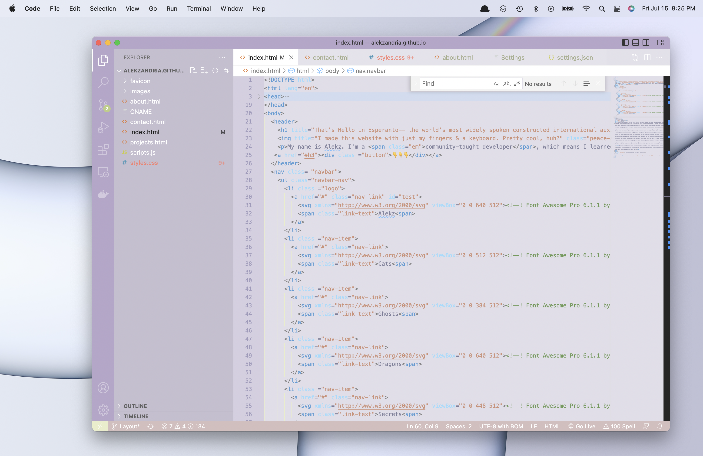

# Attica

Attica is a simple pastel theme for VSCode. ✨

## 💻 Installation

1.  One-Click Install the theme from the  [Marketplace](https://marketplace.visualstudio.com/items?itemName=Alekzandriia.attica) **[Recommended]**
2.  Go to  `File > Preferences > Color Theme`
3.  Select  `Attica`

Alternatively install via CLI:

```
code --install-extension alekzandriia.attica-theme
```

## 📷 Screenshots



## ✏️ Customization

[VSCode Theme Color Reference](https://code.visualstudio.com/api/references/theme-color)

-   Press  `F5`  to open a new window with your extension loaded.
-   Open  `File > Preferences > Color Themes`  and pick your color theme.
-   Open a file that has a language associated. The languages' configured grammar will tokenize the text and assign 'scopes' to the tokens. To examine these scopes, invoke the  `Developer: Inspect Editor Tokens and Scopes`  command from the Command Palette (`Ctrl+Shift+P`  or  `Cmd+Shift+P`  on Mac).

## 🛠 Devlopment
Attica was created using the [Theme Studio for VSCode](https://themes.vscode.one).  The Theme Studio for VS Code lets you easily design, and deploy your own VS Code themes from scratch. If you want to create your own fully customized theme I highly recommend checking it out.

## 📃 License

`after-sunset-vscode`  is under the terms of the  [MIT License](https://www.tldrlegal.com/l/mit), following all clarifications stated in the  [license file](https://marketplace.visualstudio.com/items/Alekzandriia.attica/license).<br><br>

** If you have any questions or notice any bugs please feel free to contact me at mailto:hello@alekzandriia.com **

